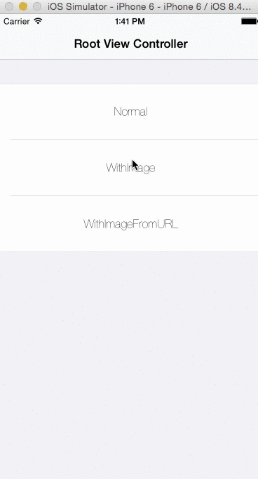
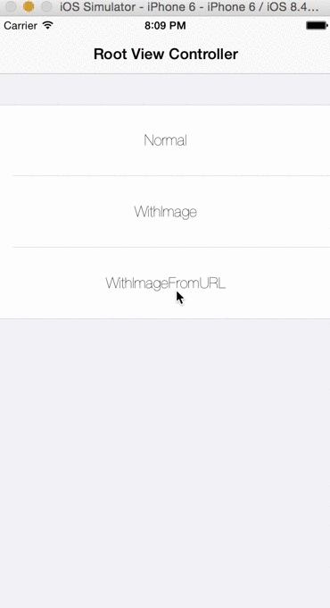

HoneycombView
========================

[](https://github.com/Carthage/Carthage)
[](http://cocoadocs.org/docsets/HoneycombView)
[](https://developer.apple.com/swift/)

iOS UIView for Honeycomb layout include with photoBrowser.



## Requirements
- iOS 8.0+
- Swift 2.0+
- ARC

##Installation

####CocoaPods
HoneycombView is available on CocoaPods. Just add the following to your project Podfile:
```
pod 'HoneycombView'
use_frameworks!
```

####Carthage
To integrate HoneycombView into your Xcode project using Carthage, specify it in your Cartfile:

```ogdl
github "suzuki-0000/HoneycombView"
```

####Manually
Add the `HoneycombView.swift` directly into your project.

##Usage
The easiest way is to instantiate its class in ViewController, configure it, and add it to a view.
If you want to know more details, see the ViewController of the example project.

- With Images
```swift
  // do some for images
  let images = [UIImage]()

  let honeycombView = HoneycombView(frame: CGRectMake(0, 0, view.frame.width, view.frame.height))
  honeycombView.diameter = 160.0
  honeycombView.margin = 1.0
  honeycombView.configrationForHoneycombViewWithImages(images)
  view.addSubview(honeycombView)
        
  honeycombView.animate(duration: 2.0)
```

You can also use from URL(String) with NSCache.

- With Images from URL
```swift
  for i in 0..<30{
    let user = User(id: i, profileImageURL: "https://placehold.jp/150x150.png")
    users.append(user)
  }
        
  let honeycombView = HoneycombView(frame: CGRectMake(0, 0, view.frame.width, view.frame.height))
  honeycombView.diameter = 100.0
  honeycombView.margin = 1.0
  honeycombView.configrationForHoneycombViewWithURL(users.map{ $0.profileImageURL })
  view.addSubview(honeycombView)

```

Other parameter is for size of HoneycombView.
Set margin parameter to 0 if you don't need margin for honeycomb.
- diameter
- margin



PhotoBrowser is inspired by [IDMPhotoBrowser](https://github.com/ideaismobile/IDMPhotoBrowser).

## Photos from 
- [Unsplash](https://unsplash.com)
- [placehold](https://placehold)

## License
HoneycombView is available under the MIT license. See the LICENSE file for more info.
